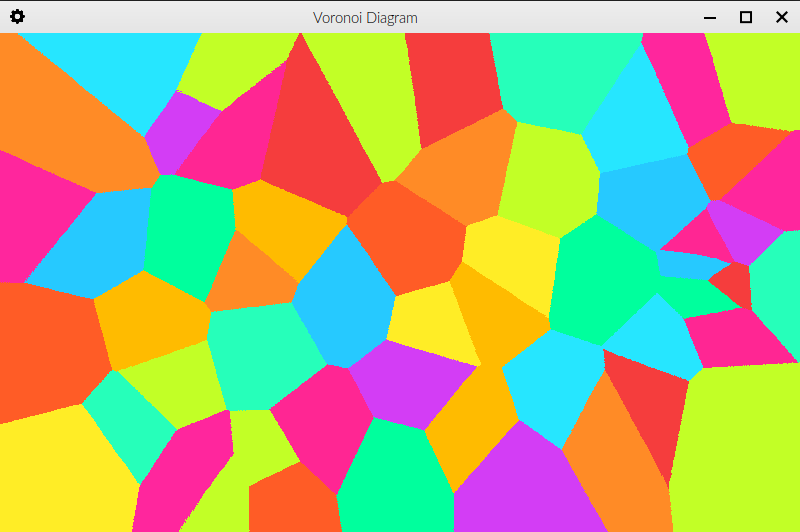
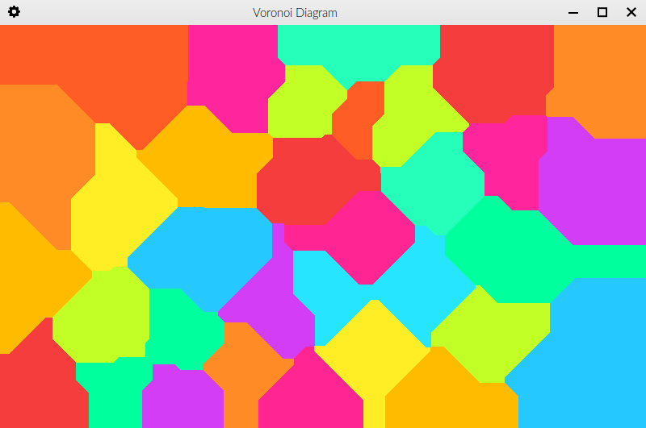
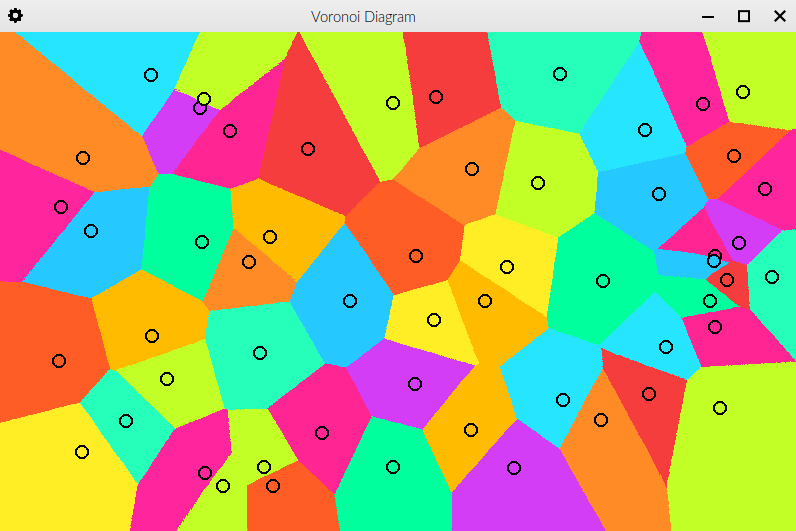

# Voronoi diagram rendered using SFML

The algorithm is not parallelized, neither on a CPU, nor on a GPU, so the calculations can be a bit slow at the beginning,
when it has to go through up to almost the entire image (compiling with -O3 helps a lot).

## Usage

Press `LMB` to place a seed.

Press `Space` to enable/disable seed rendering.

Use the `-m` or `--manhattan` flag to use Manhattan distance instead of Euclidean distance.

Use the `-b` or `--borders` flag to display a black border around every area

Seed colors are cycled through periodically. There is currently no way of selecting a custom color, though the next color
can be predicted if you pay close attention to how the colors are being cycled through.

## Compilation

`g++ src/* -I include/ -I /usr/local/lib/ -O3 -o voronoi -lsfml-system -lsfml-graphics -lsfml-window`

## Images

#### Voronoi diagram using Euclidean distance

#### Voronoi diagram using Manhattan distance

#### Voronoi diagram with seed rendering enabled

